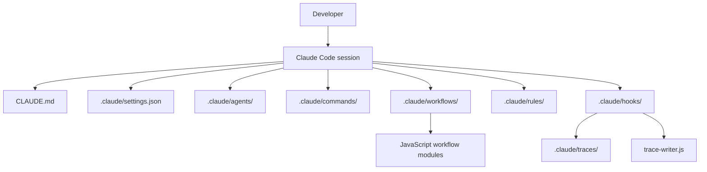

# CCSIF

CCSIF is a repository-local Claude Code scaffold for developers who want shared agent rules, hooks, workflows, and review commands around a single project constitution.

- Centralizes repo-wide behavior in [`CLAUDE.md`](./CLAUDE.md) and `.claude/settings.json`.
- Provides reusable agent, command, workflow, hook, rule, and skill definitions under `.claude/`.
- Writes lightweight trace telemetry to `.claude/traces/` so self-improvement and audit flows can inspect real session history.

## Contents

- [Quickstart](#quickstart)
- [Features](#features)
- [Architecture](#architecture)
- [Directory Structure](#directory-structure)
- [Usage](#usage)
- [Configuration](#configuration)
- [Developer Command Center](#developer-command-center)
- [Testing & Verification](#testing--verification)
- [Troubleshooting](#troubleshooting)
- [Stack Inventory](#stack-inventory)
- [Reproducibility & Maintenance](#reproducibility--maintenance)
- [Contributing](#contributing)
- [Governance](#governance)
- [Roadmap](#roadmap)
- [License](#license)

## Quickstart

### Prerequisites

- Git
- Claude Code [INFERRED from repository layout and hook/config naming]
- Bash for the project hook scripts in `.claude/hooks/`
- Node.js [INFERRED] for `.claude/workflows/*.js` and `.claude/hooks/lib/trace-writer.js`

### Clone

```bash
git clone https://github.com/JackSmack1971/CCSIF.git
cd CCSIF
```

### Install

No package manager manifest or install script was found, so there is no repository-defined install step.

### Configure

Review the repo-local instruction and policy files first:

- [`CLAUDE.md`](./CLAUDE.md)
- [`CLAUDE.local.md`](./CLAUDE.local.md) for machine-specific overrides
- [`.claude/settings.json`](./.claude/settings.json)
- [`.claude/settings.local.json`](./.claude/settings.local.json) for local-only overrides

### Run

Open the repository root in Claude Code and use the project commands, agents, workflows, and hooks from `.claude/`.

### Verify

```bash
git status --short
bash .claude/hooks/session-start.sh
```

Expected for the hook script:

- It prints `[project-hook] SessionStart`
- It prints `git status --short` output when the repository is inside a git worktree

## Features

- Shared project constitution in [`CLAUDE.md`](./CLAUDE.md) so agent behavior is anchored to one source of truth.
- Project permissions and hook wiring in [`.claude/settings.json`](./.claude/settings.json), including shell allow/deny lists and git safety checks.
- Custom slash commands for issue-to-PR, PR review, and upstream audit flows in [`.claude/commands/`](./.claude/commands/).
- Reusable agent definitions for implementation, PR review, and upstream audit work in [`.claude/agents/`](./.claude/agents/).
- Deterministic workflow scaffolds in [`.claude/workflows/`](./.claude/workflows/) for issue-to-PR and upstream audit orchestration.
- Hook-based trace capture in [`.claude/hooks/`](./.claude/hooks/) that appends daily JSONL telemetry to [`.claude/traces/`](./.claude/traces/).
- Repo-local skills and rules under [`.claude/skills/`](./.claude/skills/) and [`.claude/rules/`](./.claude/rules/) to keep agent work consistent.

## Architecture



The flow is simple:

- `CLAUDE.md` sets the repo constitution and operating rules.
- `.claude/settings.json` applies shared permissions and hook registration.
- Agents, commands, workflows, skills, and rules define the work patterns Claude Code can invoke.
- Hooks emit generated trace files so later audit or self-improvement passes can inspect what actually happened.

## Directory Structure

| Path | Why it matters |
|---|---|
| [`CLAUDE.md`](./CLAUDE.md) | Primary repo instructions and constitution. |
| [`CLAUDE.local.md`](./CLAUDE.local.md) | Local-only override file; ignored by git. |
| [`.claude/settings.json`](./.claude/settings.json) | Shared project settings, permissions, and hooks. |
| [`.claude/settings.local.json`](./.claude/settings.local.json) | Personal overrides; ignored by git. |
| [`.claude/agents/`](./.claude/agents/) | Agent definitions for implementation, review, and audit. |
| [`.claude/commands/`](./.claude/commands/) | Slash-command docs for repo workflows. |
| [`.claude/hooks/`](./.claude/hooks/) | Session hooks and the trace writer. |
| [`.claude/workflows/`](./.claude/workflows/) | JavaScript workflow scaffolds. |
| [`.claude/skills/`](./.claude/skills/) | Reusable skill definitions and references. |
| [`.claude/rules/`](./.claude/rules/) | Path-scoped behavior rules. |
| [`.claude/traces/`](./.claude/traces/) | Generated telemetry, not source. |

## Usage

This repository is best treated as a command center for Claude Code work, not as an application with a server or UI.

### Core workflow

1. Read [`CLAUDE.md`](./CLAUDE.md) before making changes.
2. Use [`.claude/commands/create-pr.md`](./.claude/commands/create-pr.md) to turn one issue into one PR.
3. Use [`.claude/commands/review-pr.md`](./.claude/commands/review-pr.md) to review one PR for merge readiness.
4. Use [`.claude/commands/audit-upstream.md`](./.claude/commands/audit-upstream.md) for audit-only issue creation.
5. Let [`.claude/hooks/`](./.claude/hooks/) write trace evidence during sessions.

### Workflow and agent map

- [`implementation-agent.md`](./.claude/agents/implementation-agent.md) implements exactly one issue per branch.
- [`pr-reviewer.md`](./.claude/agents/pr-reviewer.md) checks diffs for correctness, verification quality, and merge readiness.
- [`upstream-auditor.md`](./.claude/agents/upstream-auditor.md) is audit-only and creates one GitHub issue per confirmed finding.
- [`issue-to-pr.js`](./.claude/workflows/issue-to-pr.js) and [`upstream-audit.js`](./.claude/workflows/upstream-audit.js) are workflow scaffolds that return structured status objects.

## Configuration

| Key or file | Required | Default | Source | Description |
|---|---:|---|---|---|
| `CLAUDE.md` constitution block | Yes | N/A | [`CLAUDE.md`](./CLAUDE.md) | Repo-wide operating rules and protected areas. |
| `permissions.mode` | Yes | `ask` | [`.claude/settings.json`](./.claude/settings.json) | Default permission posture for project actions. |
| `permissions.allow` | Yes | Allowlist entries in file | [`.claude/settings.json`](./.claude/settings.json) | Permitted shell commands include `git status`, `git diff`, `git log`, `npm test`, `npm run lint`, and `npm run typecheck`. |
| `permissions.deny` | Yes | Denylist entries in file | [`.claude/settings.json`](./.claude/settings.json) | Blocks high-risk commands such as `git push --force`, `git reset --hard`, and `rm -rf`. |
| `tools.shell.timeoutSeconds` | Yes | `120` | [`.claude/settings.json`](./.claude/settings.json) | Shell command timeout for the project session. |
| `tools.git.protectBranches` | Yes | `main`, `master` | [`.claude/settings.json`](./.claude/settings.json) | Branches that should be protected from accidental edits. |
| `hooks.SessionStart` | Yes | `bash .claude/hooks/session-start.sh` | [`.claude/settings.json`](./.claude/settings.json) | Prints session start status and repo state. |
| `hooks.PreToolUse` | Yes | `bash .claude/hooks/pre-tool-use.sh` | [`.claude/settings.json`](./.claude/settings.json) | Placeholder gate for pre-tool checks. |
| `hooks.PostToolUse` | Yes | `bash .claude/hooks/post-tool-use.sh` | [`.claude/settings.json`](./.claude/settings.json) | Writes trace telemetry after tool use. |
| `hooks.Stop` | Yes | `bash .claude/hooks/stop.sh` | [`.claude/settings.json`](./.claude/settings.json) | Writes final trace telemetry at stop. |
| `EXAMPLE_LOCAL_ONLY` | No | `replace-me` | [`.claude/settings.local.json`](./.claude/settings.local.json) | Example machine-local placeholder; do not treat as a shared secret. |

No required environment variables were discovered in committed repo files.

## Developer Command Center

### Commands

| Command | Category | When to use | Source | Purpose |
|---|---|---|---|---|
| `/create-pr` | Slash command | One issue, one branch, one PR | [`.claude/commands/create-pr.md`](./.claude/commands/create-pr.md) | Standard PR creation flow. |
| `/review-pr` | Slash command | Reviewing a single PR | [`.claude/commands/review-pr.md`](./.claude/commands/review-pr.md) | Returns verdict, blocking issues, and safety notes. |
| `/audit-upstream` | Slash command | Audit-only repository review | [`.claude/commands/audit-upstream.md`](./.claude/commands/audit-upstream.md) | Creates one issue per confirmed finding. |

### Agents

| Agent | Role | Scope | Source path |
|---|---|---|---|
| `implementation-agent` | Implements exactly one issue as an isolated branch and PR. | One issue per branch. | [`.claude/agents/implementation-agent.md`](./.claude/agents/implementation-agent.md) |
| `pr-reviewer` | Reviews PRs for correctness, verification quality, and merge readiness. | One PR. | [`.claude/agents/pr-reviewer.md`](./.claude/agents/pr-reviewer.md) |
| `upstream-auditor` | Creates one GitHub issue per confirmed repository finding. | Audit-only. | [`.claude/agents/upstream-auditor.md`](./.claude/agents/upstream-auditor.md) |

### Skills / Workflows

| Skill or workflow | When to invoke | What it checks | Source path |
|---|---|---|---|
| `repo-audit` | When you need a broad repository audit | Runtime, tests, CI, dependencies, security, architecture, docs, and governance | [`.claude/skills/repo-audit/SKILL.md`](./.claude/skills/repo-audit/SKILL.md) |
| `self-improve` | When explicitly running `/self-improve` [INFERRED] | Trace-backed improvement proposals for CLAUDE/skills/hooks/MCP config | [`.claude/skills/self-improve/SKILL.md`](./.claude/skills/self-improve/SKILL.md) |
| `dependency-audit` | When inspecting manifests and lockfiles | Supply-chain risk, vulnerable packages, and install behavior | [`.claude/skills/dependency-audit/SKILL.md`](./.claude/skills/dependency-audit/SKILL.md) |
| `fsv-verify` | Before and after any mutation | Read-before-act, act once, read-after-act, diff verification | [`.claude/skills/fsv-verify/SKILL.md`](./.claude/skills/fsv-verify/SKILL.md) |
| `upstream-audit.js` | Workflow orchestration [INFERRED] | Upstream audit step sequencing | [`.claude/workflows/upstream-audit.js`](./.claude/workflows/upstream-audit.js) |
| `issue-to-pr.js` | Workflow orchestration [INFERRED] | Issue-to-PR step sequencing | [`.claude/workflows/issue-to-pr.js`](./.claude/workflows/issue-to-pr.js) |

### Hooks / Permissions

| Hook or permission | Event/scope | Purpose | Source path |
|---|---|---|---|
| `SessionStart` | Claude Code session start | Prints `[project-hook] SessionStart` and current git status | [`.claude/hooks/session-start.sh`](./.claude/hooks/session-start.sh) |
| `PreToolUse` | Before each tool use | Placeholder for deny checks and protection gates | [`.claude/hooks/pre-tool-use.sh`](./.claude/hooks/pre-tool-use.sh) |
| `PostToolUse` | After each tool use | Best-effort trace capture | [`.claude/hooks/post-tool-use.sh`](./.claude/hooks/post-tool-use.sh) |
| `Stop` | Session stop | Final trace capture and summary | [`.claude/hooks/stop.sh`](./.claude/hooks/stop.sh) |
| `trace-writer.js` | Hook helper | Appends daily JSONL trace entries and redacts common secrets | [`.claude/hooks/lib/trace-writer.js`](./.claude/hooks/lib/trace-writer.js) |
| `permissions.allow` | Shell allowlist | Limits routine shell commands to safe inspection and test commands | [`.claude/settings.json`](./.claude/settings.json) |
| `permissions.deny` | Shell denylist | Blocks destructive and forceful operations | [`.claude/settings.json`](./.claude/settings.json) |

## Testing & Verification

No automated test suite, build pipeline, or CI workflow was found in the repository.

Grounded verification options:

```bash
git status --short
git diff --check
bash .claude/hooks/session-start.sh
```

Use the narrowest check that matches the change:

- Edit docs or config: `git diff --check`
- Adjust hooks or settings: run the affected hook script directly
- Change workflow or agent docs: re-read the file and compare against `CLAUDE.md`

## Troubleshooting

| Symptom | Likely cause | Exact fix |
|---|---|---|
| `bash: ...: command not found` | Bash is not available in the current shell | Run the repo in Bash, Git Bash, WSL, or another environment that can execute `.sh` hooks. |
| No files appear in `.claude/traces/` after work | `PostToolUse` / `Stop` hooks are not firing, or `node` is unavailable [INFERRED] | Confirm `.claude/settings.json` still points at the hook scripts and that Node.js is installed for `trace-writer.js`. |
| `git status --short` shows unexpected local files | Generated traces or local overrides were created | Leave generated traces in `.claude/traces/` and keep personal settings in `CLAUDE.local.md` or `.claude/settings.local.json`; do not commit them. |
| A command you expect to work is blocked | It is not on the shell allowlist or it is on the denylist | Check [`.claude/settings.json`](./.claude/settings.json) and use an allowed inspection command instead. |

## Stack Inventory

| Layer | Technology | Version | Source | Notes |
|---|---|---|---|---|
| Repo type | Claude Code agent scaffold [INFERRED] | Unknown | `CLAUDE.md`, `.claude/` layout | Repository-local automation and policy bundle. |
| Scripting runtime | Node.js [INFERRED] | Unknown | `.claude/workflows/*.js`, `.claude/hooks/lib/trace-writer.js` | JavaScript workflow and hook helper files use Node shebangs. |
| Hook shell | Bash [INFERRED] | Unknown | `.claude/hooks/*.sh` | Session, pre-tool, post-tool, and stop hooks are shell scripts. |
| Policy format | Markdown / JSON | N/A | `CLAUDE.md`, `.claude/settings.json`, `.claude/**/*.md` | Human-readable repo instructions and settings. |
| Telemetry format | JSONL | N/A | `.claude/traces/*.jsonl` | Append-only generated trace corpus. |

## Reproducibility & Maintenance

- Fresh clone check: `git status --short` should be clean immediately after cloning.
- Re-read the live source of truth before edits: `CLAUDE.md`, `.claude/settings.json`, and the specific agent/command/hook file you plan to touch.
- Keep local-only settings in `CLAUDE.local.md` and `.claude/settings.local.json`; both are treated as local overrides in `.gitignore`.
- If trace history gets noisy, treat `.claude/traces/*.jsonl` as generated telemetry and start from a fresh session rather than editing the files by hand.
- On Windows, ensure the shell can run Bash scripts before relying on hooks.

## Contributing

See [`CONTRIBUTING.md`](./CONTRIBUTING.md) for how to find or propose work, set up locally, and open a pull request.

## Governance

| Area | Status | Source |
|---|---|---|
| Code of Conduct | [TBD] | No `CODE_OF_CONDUCT.md` file was found. |
| Security | Repo-local rules exist | [`CLAUDE.md`](./CLAUDE.md), [`.claude/rules/security.md`](./.claude/rules/security.md) |
| License | [TBD] | No `LICENSE` file or manifest license field was found. |
| Maintainers | [TBD] | No maintainer file was found. |
| Support | [TBD] | No support policy file was found. |

## Roadmap

No roadmap document, issue milestone plan, or release plan was found in the repository.

## License

No license file was found. Add a license before publishing or accepting contributions.
